# Decodificador de Texto
#### Projeto proposto no desafio da trilha Iniciante em programação da Alura em parceria com a Oracle

<div style="display:flex; gap:3%;">
  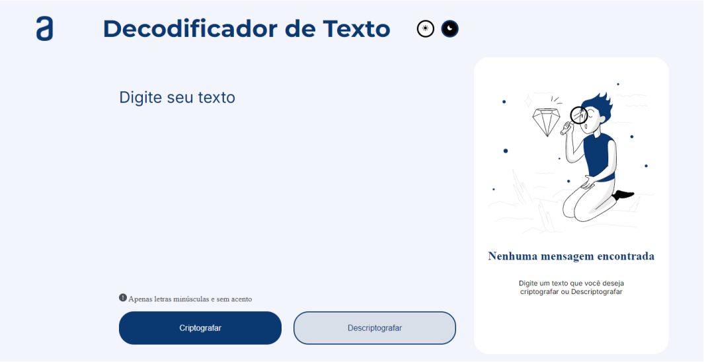
  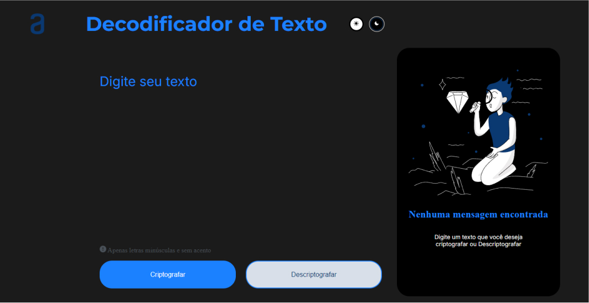
</div>

<br><br>

## Tecnologias utilizadas 🖥️


#### Para criar este projeto nos baseamos no conteúdo presente nas aulas dos cursos da Alura nos fornecido atráves do programa de trilhas Oracle One:

<div align="center">

</div>

<hr>

> O aplicação se trata de um jogo de decodificação, onde o usuário digitará um texto de sua preferência e ao clicar no botão terá sua mensagem criptografada, em contrapartida poderá descriptografar a mensagem em seguida utilizando outro botão.
> O objetivo é treinar um pouco de lógica atráves do JavaScript

Para estrutura dos componentes presentes na aplicação, como esperado, utilizei a linguagem de marcação de hipertexto HTML5, presente em todas as aplicações Web atualmente.

Para saber mais acesse o link abaixo⤵️

<a href="https://developer.mozilla.org/en-US/docs/Web/HTML" target="_blank">
    
</a>


<figure>
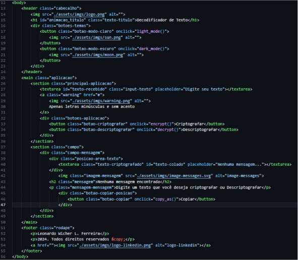

#### Corpo da página usando um pouco de HTML Semântico.
</figure>

> Ao olhar o código percebe-se que todas as tags "botões" estão com o atributo ```'onclick=""```; e o mesmo é responsável por chamar a função que será executada ao 'clicar' no botão.

A fim de motorizar a aplicação todas as funções e partes que movimentam o código foram feitas utilizando a linguagem de programação JavaScript.

Para saber mais acesse o link abaixo⤵️

<a href="https://developer.mozilla.org/en-US/docs/Web/JavaScript" target="_blank">


</a>

#### Conectando o HTML com o diretório e arquivo do código JS

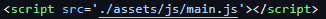


A primeira função visível na aplicação é a mais complexa, é um evento que é acionado assim que o documento é carregado, e adiciona ao título caracteres aleatórios que serão substituídos pelo texto original dando a impressão de descriptografia.

Tudo feito atráves de lógica e com uma pitada da biblioteca:  **animejs**

Para saber mais acesse o link abaixo⤵️

<a href="https://animejs.com/documentation/" target="_blank">


</a>

#### Conectando o Cabeçalho do nosso HTML com a lib animejs

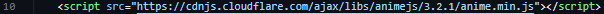

<br>

## Efeito do Título1️⃣
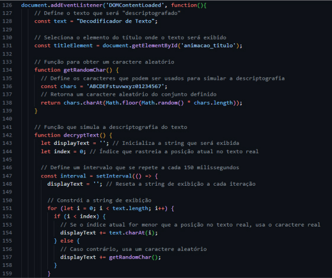
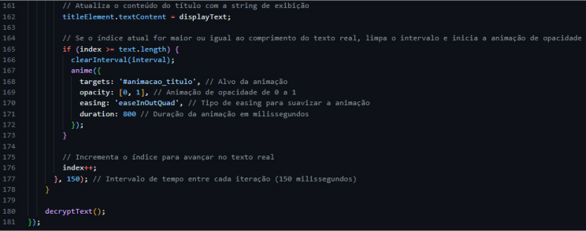

<br>

### Resultado
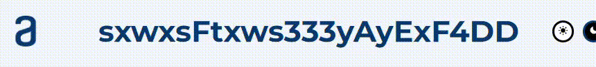

<hr>

## Temas claro e escuro2️⃣
Outro diferencial que quis por em minha aplicação foi a troca de temas. Por padrão o tema claro é inicializado ao carregar a página, e a troca é feita pelos ícones de sol e lua posicionados ao lado do título.


> Estas funções se baseiam no meu código de estilo css, onde eu crio váriaveis para armezenar diferentes tipos de cores.

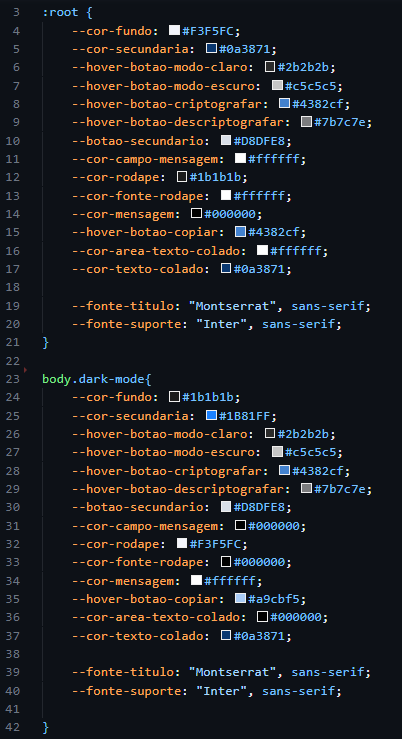

> As váriaveis criadas dentro de ```:root``` são as que contém as cores do tema claro, e a classe criada para substitui-las ```dark-mode``` contém o tema escuro. As funções mostradas acima acessam a lista de classes presente no documento removendo a atual e substituindo pela outra assim:

### Temas
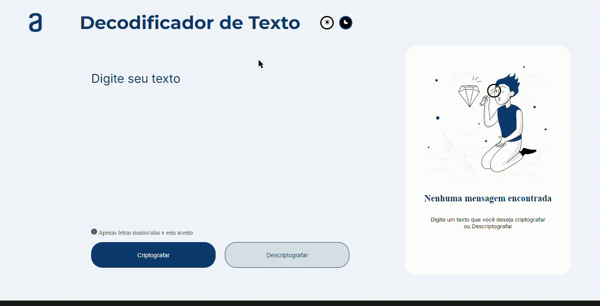

<hr>

## Criptografar o texto3️⃣

A função para criptografar utiliza um padrão de substituir somente as vogais por ```strings``` específicas.
> Ela armazena o valor digitado no input em uma variável, e um valor vazio na variável que irá receber o texto criptografado. Posteriormente os caracteres são limitados de acordo com as regras do jogo e verifica se o campo está vazio, caso não o objeto criado contendo chave e valor com o padrão de criptografia será percorrido em um laço de repetição substituindo as vogais e mantendo as consoantes. Isso faz com a visibilidade do documento seja modificada tornando o campo com a mensagem criptografada visível e as mensagens invisíveis para o usuário.

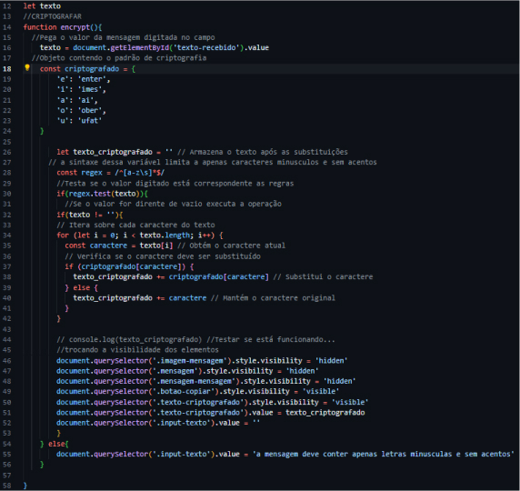

## Copiar4️⃣
Função de copiar mensagem para descriptografia.
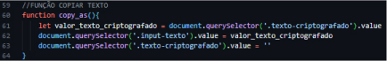

## Descriptografar a mensagem5️⃣

Essa função utiliza uma lógica diferente da outra percorrendo a mensagem criptografada e substituindo as ```strings``` padrão pelas vogais correspondentes.
> Ela pega o valor da mensagem criptografada e também armazena em uma nova variável a mensagem correta de forma parecida com a outra, mas aqui usamos o método ```startsWith``` que vai procurar uma ```sub-string``` dentro da ```string``` de texto. Assim, substituindo pela vogal e pulando o tamanho do caractere correspondente enquando o contador do laço for menor que o tamanho da mensagem secreta. Ao final o campo é limpo a mensagem verdadeira é mostrada no input principal.

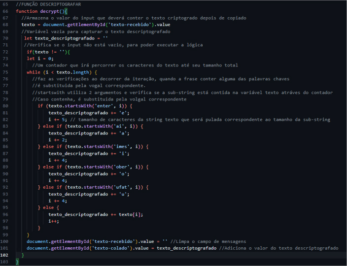

<hr>

<br>

A estilização foi feita toda com o famoso CSS puro, sem a adição de frameworks, o Design conversa de forma responsiva com outros dispositivos como Tablets e Celulares com exceção de **ALGUNS** casos...

<br>

<div style="display:flex; gap:10%; justify-content:center;">
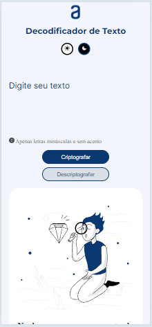
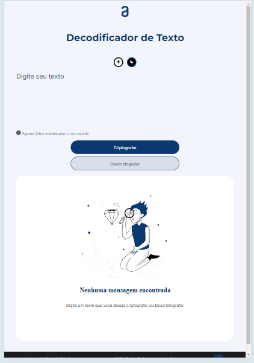
</div>

<br>

> O CSS é uma linguagem de folha de estilo em cascata utilizada para decorar os elementos das páginas WEB

Para saber mais sobre o CSS acesse o link abaixo⤵️
<a href="https://developer.mozilla.org/en-US/docs/Web/CSS" target="_blank">


</a>

### Confira o código CSS &nbsp;

 **[CSS](./assets/css/main.css)** 